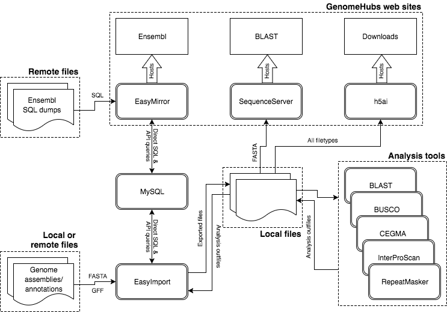
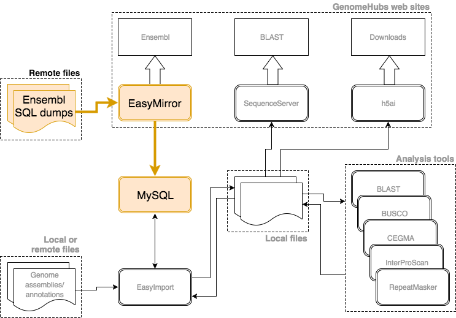
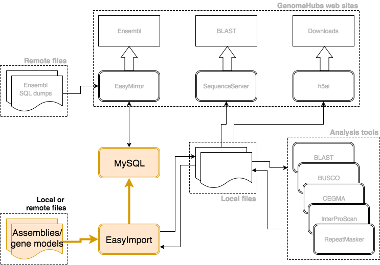
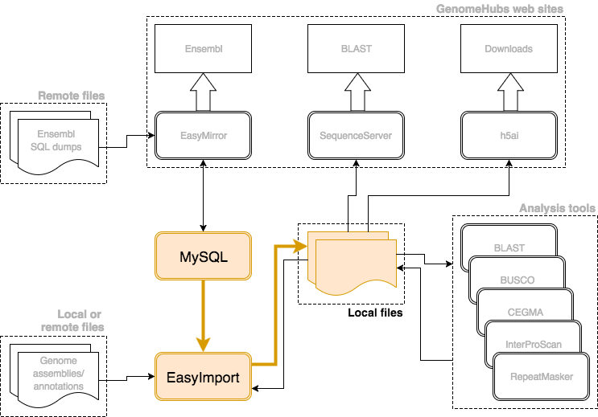
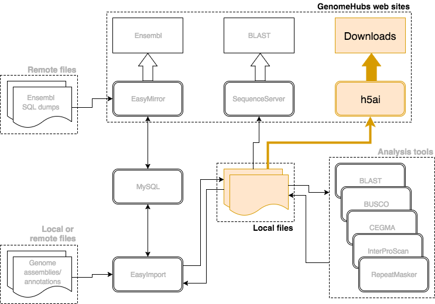
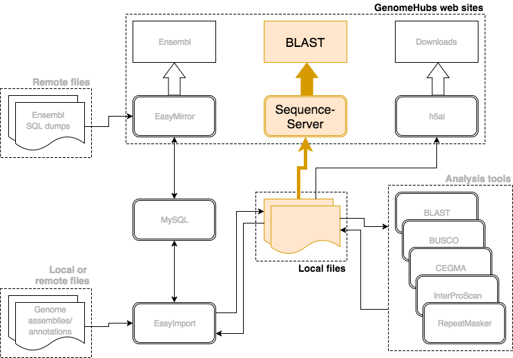
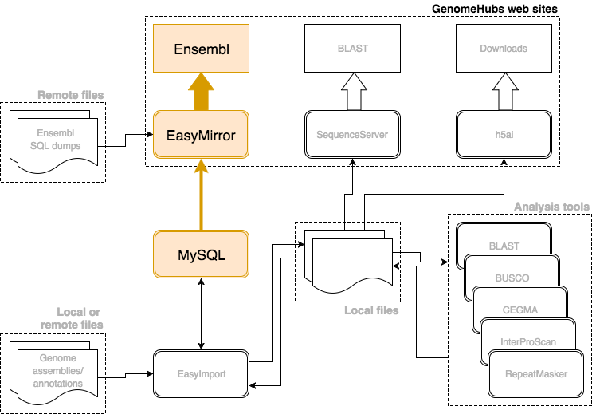

# Workshop Basics

Go to [IP address spreadsheet](https://docs.google.com/spreadsheets/d/1wsiuloV9Lpt6XPWg1Cgd7cz3V7kIlxZBDH6parfQZcA/edit?usp=sharing)

Put your name against an IP address.

Log into the machine using the IP address and password `genomehubs` (`$` indicates a command prompt that you should copy-paste and press enter) like this:

```
# replace IP address:
$ ssh ubuntu@34.248.77.11
```

Once you are logged into the Amazon VM, get a copy of the workshop scripts:

```
$ cd ~
$ git clone https://github.com/genomehubs/ags-2017-workshop.git
$ cd ~/ags-2017-workshop
```

If you type:
```
$ ls -1 *sh
```
you should see eight `.sh` scripts that you have to run in order:
```
01_prepare.sh
02_setup_mysql.sh
03a_test_ensembl.sh
03_import.sh
04_export_files.sh
08_start_download.sh
09_start_blast.sh
11_start_ensembl.sh
```

To run each script, you would type
```
$ ./0N_script_name.sh
```

In scripts 03a 09 and 11, you will be prompted to edit a particular file. After editing the file, type `Ctrl+x` to save it

# GenomeHubs Overview

The full documentation is at https://genomehubs.gitbooks.io/genomehubs/content/, but we are only going to run a subset of the quick start guide (no analyses like repeatmasker/interproscan etc) as we have limited time.

Today we're going to use five docker containers (double lines: MySQL, EasyMirror, EasyImport, SequenceServer, h5a1) to set up three websites:
* ensembl.example.com
* blast.example.com
* download.example.com



## 01_prepare.sh

Make sure you are in the ags-2017-workshop folder and then type:
```
$ ./01_prepare.sh
```

As you wait for it to run, let's look at what it does:


```bash
#!/bin/bash
##==============================================================================
##  01_prepare.sh
##==============================================================================

## Update system

sudo apt update
sudo apt upgrade -y

## Install docker.io and git

sudo apt install -y docker.io git
sudo usermod -aG docker $USER

## Pull docker repos

docker pull genomehubs/easy-mirror
docker pull genomehubs/easy-import
docker pull genomehubs/sequenceserver
docker pull genomehubs/h5ai

##------------------------------------------------------------------------------
## Create a new directory in your home directory

mkdir ~/genomehubs && cd ~/genomehubs

##------------------------------------------------------------------------------
## Clone the example configuration files from genomehubs/template:
## Naming the template directory v1 is convenient for site versioning

git clone https://github.com/genomehubs/template v1

##------------------------------------------------------------------------------
## Install and configure lighttpd for redirecting domain names

sudo apt install -y lighttpd

sudo perl -i.bak -plne 's/mod_rewrite",/mod_rewrite",\n  "mod_proxy",/' \
  /etc/lighttpd/lighttpd.conf

echo '
$HTTP["host"] =~ "ensembl.example.com"{
  proxy.server = ("" => ("" => (
    "host" => "127.0.0.1",
    "port" => "8081",
    "fix-redirects" => 1
  )))
}
$HTTP["host"] =~ "download.example.com"{
  proxy.server = ("" => ("" => (
    "host" => "127.0.0.1",
    "port" => "8082",
    "fix-redirects" => 1
  )))
}
$HTTP["host"] =~ "blast.example.com"{
  proxy.server = ("" => ("" => (
    "host" => "127.0.0.1",
    "port" => "8083",
    "fix-redirects" => 1
  )))
}
' | sudo tee -a /etc/lighttpd/lighttpd.conf >/dev/null

sudo service lighttpd restart
```

## 02_setup_mysql.sh

This step will download all the MySQL tables of a default ensembl species database (the butterfly *Melitaea cinxia*) locally, and all the other tables needed for Ensembl to run.

Please type/copy-paste the following command:
```
$ ./02_setup_mysql.sh
```

While it's running, here's what it's doing:



```bash
#!/bin/bash
##==============================================================================
##  02_setup_mysql.sh
##==============================================================================

## Create a mysql/data directory to allow the databases to be stored
## outside of the MySQL container:

mkdir -p ~/genomehubs/mysql/data

##------------------------------------------------------------------------------
## Create a MySQL Docker container to host the Ensembl Databases
## for your GenomeHub and wait 10 seconds for it to start:

docker run -d \
  --name genomehubs-mysql \
  -v ~/genomehubs/mysql/data:/var/lib/mysql \
  -e MYSQL_ROOT_PASSWORD=CHANGEME \
  -e MYSQL_ROOT_HOST='172.17.0.0/255.255.0.0' \
  -p 3306:3306 \
  mysql/mysql-server:5.5

sleep 10

##------------------------------------------------------------------------------
## Increase MySQL max_allowed_packet to allow import of large scaffolds:

docker exec genomehubs-mysql mysql -u root --password=CHANGEME -e \
  'set global max_allowed_packet=10000000000;'

##------------------------------------------------------------------------------
## Run the `database.sh` script in a `genomehubs/easy-mirror` Docker container:
## This script will set up database users and import databases into your MySQL
## container based on the information in the `database.ini` configuration file.

docker run --rm \
  --name genomehubs-ensembl \
  -v ~/genomehubs/v1/ensembl/conf:/ensembl/conf:ro \
  --link genomehubs-mysql \
  genomehubs/easy-mirror:latest \
  /ensembl/scripts/database.sh /ensembl/conf/database.ini
```

## 03a_test_ensembl.sh

This step will test that the software is installed, and that the default data has been imported.

In this step, you have to edit the setup.ini file that pops up and add a NEW species database that you want to mirror. Please type/copy-paste the following command:

```
$ ./03a_test_ensembl.sh
```

First, comment out these three lines:
```
#  GENOMEHUBS_PLUGIN_URL = https://github.com/genomehubs/gh-ensembl-plugin
#  GENOMEHUBS_PLUGIN_BRANCH = develop
#  GENOMEHUBS_PLUGIN_PACKAGE = EG::GenomeHubs
```
Now visit this URL: ftp://ftp.ensemblgenomes.org/pub/release-32/metazoa/mysql

Choose any species database you would like in a new line under [SPECIES_DBS]. This will "Mirror" the content of the existing Ensembl database, but will not download the files. Eg, you can pick:

```
[DATA_SOURCE]
  SPECIES_DBS = [
    melitaea_cinxia_core_32_85_1
    bombus_impatiens_core_32_85_2
]
```
Note: do not put the trailing slash `/`

Once you have made the changes, press `Ctrl + x` which will save the file, and continue running the rest of the script.

Here's what it's doing:
```bash
#!/bin/bash
##==============================================================================
##  03a_test_ensembl.sh
##==============================================================================

## WORKSHOP PARTICIPANTS DO THIS STEP BEFORE RUNNING THIS SCRIPT
## Edit setup.ini config file, add a new line to SPECIES_DBS
## choose ensembl database name from
## ftp://ftp.ensemblgenomes.org/pub/release-32/metazoa/mysql
## eg:
## SPECIES_DBS = [
##   melitaea_cinxia_core_32_85_1
##   aedes_aegypti_core_32_85_3
## ]
## and comment out the 3 lines beginning GENOMEHUBS_PLUGIN_...

nano ~/genomehubs/v1/ensembl/conf/setup.ini

##------------------------------------------------------------------------------
## Run the `genomehubs/easy-mirror` Docker container to launch the site

docker run -d \
  --name genomehubs-ensembl \
  --volume ~/genomehubs/v1/ensembl/conf:/ensembl/conf:ro \
  --link genomehubs-mysql \
  -p 8081:8080 \
  genomehubs/easy-mirror:latest
```

## 03_import.sh

This step is to import a brand new species *Operophtera brumata* from scratch. We'll go through all the steps in detail, but first run the script:

```
$ ./03_import.sh
```



```bash
#!/bin/bash
##==============================================================================
##  03_import.sh
##==============================================================================

## Run the genomehubs/easy-import Docker container to import FASTA + GFF

docker run --rm \
  -u $UID:$GROUPS \
  --name easy-import-operophtera_brumata_obru1_core_32_85_1 \
  --link genomehubs-mysql \
  -v ~/genomehubs/v1/import/conf:/import/conf \
  -v ~/genomehubs/v1/import/data:/import/data \
  -e DATABASE=operophtera_brumata_obru1_core_32_85_1 \
  -e FLAGS="-s -p -g" \
  genomehubs/easy-import:latest
```

## 04_export_files.sh

This step creates the sequence, gff3, embl, json files, and takes the longest to run, so we can take a break and have more questions about the previous step.

But first, run the script:

```
$ ./04_export_files.sh
```



```bash
#!/bin/bash
##==============================================================================
##  04_export_files.sh
##==============================================================================

## Run the genomehubs/easy-import Docker container to export
## FASTA/GFF/json files and to index the search database
## Files for download will be written to directories under
## ~/genomehubs/v1/download/data/
## Files ready to format as BLAST databases will be written to
## ~/genomehubs/v1/blast/data/

docker run --rm \
  -u $UID:$GROUPS \
  --name easy-import-operophtera_brumata_obru1_core_32_85_1 \
  --link genomehubs-mysql \
  -v ~/genomehubs/v1/import/conf:/import/conf \
  -v ~/genomehubs/v1/import/data:/import/data \
  -v ~/genomehubs/v1/download/data:/import/download \
  -v ~/genomehubs/v1/blast/data:/import/blast \
  -e DATABASE=operophtera_brumata_obru1_core_32_85_1 \
  -e FLAGS="-e -f -j -i" \
  genomehubs/easy-import:latest
```

## 08_start_download.sh

```
$ ./08_start_download.sh
```



```bash
#!/bin/bash
##==============================================================================
##  08_start_download.sh
##==============================================================================

docker run -d \
  --name genomehubs-h5ai \
  -v ~/genomehubs/v1/download/conf:/conf:ro \
  -v ~/genomehubs/v1/download/data:/var/www/v1:ro \
  -p 8082:8080 \
  genomehubs/h5ai:latest
```

## 08_start_download.sh

```
$ ./08_start_download.sh
```


```bash
#!/bin/bash
##==============================================================================
##  08_start_download.sh
##==============================================================================

docker run -d \
  --name genomehubs-h5ai \
  -v ~/genomehubs/v1/download/conf:/conf:ro \
  -v ~/genomehubs/v1/download/data:/var/www/v1:ro \
  -p 8082:8080 \
  genomehubs/h5ai:latest
```

## 09_start_blast.sh

```
$ ./09_start_blast.sh
```



```bash
#!/bin/bash
##==============================================================================
##  09_start_blast.sh
##==============================================================================

## WORKSHOP PARTICIPANTS DO THIS STEP BEFORE RUNNING THIS SCRIPT
## Edit links.rb to ensure that links from BLAST results are directed
## to your Ensembl site:

## keys in taxa should match your database name(s) and
## values should match the corresponding SPECIES.URL, e.g.,
## taxa["aedes_aegypti_core_32_85_3"] = "Aedes_aegypti"

## modify the url = "http://ensembl.example.com/#{assembly}" to match
## your domain name

nano ~/genomehubs/v1/blast/conf/links.rb

docker run -d \
  --name genomehubs-sequenceserver \
  -v ~/genomehubs/v1/blast/conf:/conf \
  -v ~/genomehubs/v1/blast/data:/dbs \
  -p 8083:4567 \
  genomehubs/sequenceserver:latest
```

## 11_start_ensembl.sh

```
$ ./11_start_ensembl.sh
```



```bash
#!/bin/bash
##==============================================================================
##  11_start_ensembl.sh
##==============================================================================

## WORKSHOP PARTICIPANTS DO THIS STEP BEFORE RUNNING THIS SCRIPT
## Edit setup.ini to ensure that your two extra species are in SPECIES_DBS
## eg
## SPECIES_DBS = [
##   melitaea_cinxia_core_32_85_1
##   operophtera_brumata_obru1_core_32_85_1
##   aedes_aegypti_core_32_85_3
## ]

nano ~/genomehubs/v1/ensembl/conf/setup.ini

##------------------------------------------------------------------------------
## Start the EasyMirror container after removing the existing one, if any

docker rm -f genomehubs-ensembl

docker run -d \
  --name genomehubs-ensembl \
  -v ~/genomehubs/v1/ensembl/conf:/ensembl/conf:ro \
  --link genomehubs-mysql \
  -p 8081:8080 \
  genomehubs/easy-mirror:latest
```
